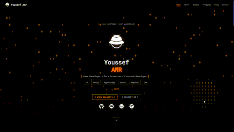
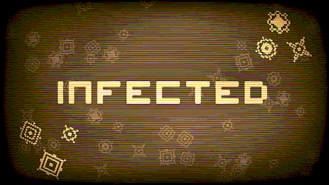
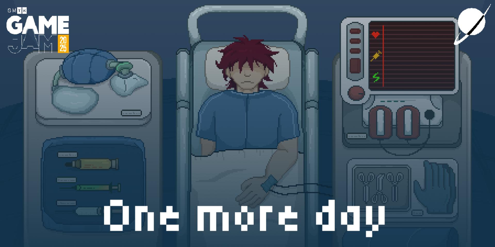
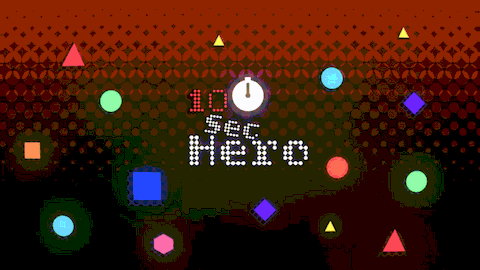

<div style="isplay:flex; gap: 1em; justify-content:center; align-items:center;text-align:center;">

</div>
<div style="display:flex; gap: 1em; justify-content:center; align-items:center;text-align:center; font-size:1.2em;font-family:monospace;">
<a href="https://youssefamr-thesolodev.web.app" style="color:#ff8800;">> See my Portfolio <</a>
</div>

# `>_ whoami`

# Youssef Amr

**[ Game Developer · Systems Builder · Data Scientist · Frontend Developer ]**


```bash
$ cat ./profile.json
{
  "name": "Youssef Amr",
  "handle": "TheSoloDev",
  "role": "Game Developer | Systems Builder | Data Scientist",
  "location": "Alexandria, Egypt",
  "education": "Data Science @ Alexandria University",
  "experience": "10+ years shipping",
  "shipped": "10+ games · 8 compilers",
  "status": "building"
}
```

---

## `>_ about`

I've been coding since I was 11. Ten years later, I don't stop.

I write **games**, **compilers**, and **physics simulations**. I've shipped over a dozen games, built eight compilers and interpreters, and designed my own programming language.

I'm a data science major at Alexandria University — but my real education came from shipping. If it's hard and it needs to exist, I build it.

I believe in **clear credit**, **honest work**, and **finishing what you start**. I've learned the hard way that agreements, ownership, and attribution matter as much as the code itself. That lesson shaped how I build teams, tools, and studios today.

---

## `>_ tech_stack`

| Layer                  | Tools                                                           |
| ---------------------- | --------------------------------------------------------------- |
| 🎮 Game Engines        | Unity (C#), Godot                                               |
| 💻 Languages           | C#, C, C++, Python, R, Java, JavaScript, TypeScript, Assembly, HLSL  |
| 🧠 Compilers & Systems | Custom language (Y#), 8 compilers/interpreters, Unix shell in C |
| 📦 Frameworks          | Angular, Flask, Django, Node.js, Flutter                        |
| 📊 Data & ML           | Pandas, NumPy, Scikit-Learn, XGBoost, Streamlit                 |
| ☁️ Cloud / DevOps      | AWS (EC2, S3, Lambda), Docker, GitHub Actions, Firebase                   |
| 🎨 Creative Tools      | Unity, Pixelorama, LMMS, Krita, Blender               |


<details>
<summary><code>>_ click_to_expand : full_tech_stack</code></summary>

<br>

- **Languages** · C#, C, C++, Python, R, Java, JavaScript, TypeScript, Assembly
- **Engines** · Unity, Godot
- **Web** · Angular, Flask, Django, Node.js, Flutter
- **Data/ML** · Pandas, NumPy, Scikit-Learn, XGBoost, Streamlit
- **Cloud** · AWS (EC2, S3, Lambda), Docker, GitHub Actions
- **Creative** · Pixelorama, LMMS, Krita, Blender, HLSL

</details>

---
## `>_ currently_building`

### 🦠 INFECTED — _Roguelite Tower Defense_
<div style="isplay:flex; gap: 1em; justify-content:center; align-items:center;text-align:center;">

</div>
> Your computer is dying. Build firewalls. Clean the infection. Prestige. Repeat.

- 5 worlds: CPU, RAM, HDD, Network, Kernel
- 9 weapons, 8 equipment slots, 30 upgrade cards
- 6 tech trees — 82 total upgrades
- 11 unique enemies (Worm, Trojan, Ransomware, Rootkit, etc.)
- Custom HLSL shaders (CRT, glitch, scanlines)

---

### 📡 OPERATOR — _Radar Simulation_
<div style="isplay:flex; gap: 1em; justify-content:center; align-items:center;text-align:center;">

</div>
> You are a radar operator. Guide planes. Avoid enemies. Survive storms. Upgrade your station.

- Custom HLSL radar sweep with decay function
- Jamming zones, enemy fighters, civilian traffic
- Days, upgrades, station progression

---

### 🏥 One More Day — _Narrative · GMTK 2025 Top 7%_
<div style="isplay:flex; gap: 1em; justify-content:center; align-items:center;text-align:center;">

</div>
> A doctor trapped in a hospital timeloop, trying to save loved ones.

- Built in 3 days for GMTK 2025 with a team of 18 creators.
- **Led development**: designed the core loop, wrote the code, coordinated the team
- **Rebuilt solo** after the jam — new dialogue, cutscenes, and map
- **Credit** — fully credited to every contributor, and if you wanna see the amazing creators see the [Credits](./CREDITSFORONEMOREDAY.md)

---

### ⚡ Ten Second Hero — _GMTK 2026 · Top 11% Enjoyment_

<div style="isplay:flex; gap: 1em; justify-content:center; align-items:center;text-align:center;">

</div>
> Dash. Kill. Add time. Defend the door. Survive the countdown.

- Built **solo in 27 hours**, submitted 6 hours early
- 3 levels, 9 enemies, custom halftone shader
- Music system where kills build the soundtrack
- **Top 11% for Enjoyment** — outscored larger teams on the metric that matters most

---

<!--
 Developer note: i will add them later in development
 ### ⚡ ENERGY — _City Builder · My Childhood Dream Game_


> Balance energy production and pollution. Build the city. Survive the trade-offs.

- Day/night cycle, weather, resource management
- The game that started everything.

---

### 🎮 EVI — _Hidden in My Portfolio · Unity WebGL_


> An astronaut named Evi asks: "Want to play a game?"

- 2D space exploration (KSP-lite)
- Plant flags on 5 planets. Collect gems. Return to Earth.
- Achievements save to the website
- **Find her on my portfolio's contact page**

---
### 🧠 CONSOLE — _Coding Puzzle Game_


> 8 programming languages. 2000+ problems. Build your rig. Solve the code.

- Compilers/interpreters for: ASM, Basic, Python, LOA, C-like, Java-like, Y# (my language), Elixir-like
- Upgrade tree (registers, call stack, memory)
- Visual execution model

---
--- -->

## `>_ what_i_build`

```yaml
interests:
  - Custom compilers & programming languages
  - Physics simulations (FTL spacetime, black hole geometry)
  - Systems that feel alive (radar, infection, AI adaptation)
  - Tools that teach (coding puzzles, training materials, cheat sheets)
  - Games that mean something
```

## `>_ stats`
<div style="display:flex; gap: 1em; justify-content:center; align-items:center;">


</div>

## `>_ connect`

```bash
$ ping youssef
[→] Portfolio   : https://youssefamr-thesolodev.web.app
[→] LinkedIn    : https://www.linkedin.com/in/youssef-amr-2ba9962b5/
[→] Email       : youssefamr.thesolodev@gmail.com
```

```
> exit
*connection closed by user*
<<<<<<< HEAD
```
=======
```
>>>>>>> 00598a55acf905cd9e2adb091acf4c31fcf7520b
